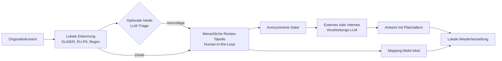

# Benutzerleitfaden für `local-anonymizer`

`local-anonymizer` unterstützt dich dabei, vertrauliche Angaben aus Dokumenten
zu entfernen, bevor du deren Inhalt an ein externes KI-System weitergibst.
Die Erkennung, die Zuordnung der Platzhalter und die Wiederherstellung bleiben
auf deinem eigenen Rechner.

Dieser Leitfaden richtet sich an Studierende, Kolleginnen und Kollegen sowie an
alle anderen Personen, die das Werkzeug ohne vertiefte Programmierkenntnisse
verwenden möchten.

## Der empfohlene Ablauf

Du behältst jederzeit die volle Kontrolle (Human-in-the-Loop): Nach der Erkennung kannst du optional einen lokalen LLM-Review-Assistenten zuschalten, der Vorschläge zur Bereinigung von False Positives und Rollen-Deskriptoren macht. Erst durch deine explizite Bestätigung in der Review-Tabelle werden Anpassungen wirksam. Danach gibst du nur die anonymisierte Datei an dein Ziel-LLM weiter. Die geheime Mapping-Tabelle bleibt auf deinem Rechner und wird für die spätere Wiederherstellung genutzt.

## Wichtiger Plattformhinweis

Der beschriebene und überprüfte Referenzweg ist Windows. Die Dateien für einen
macOS-Start sind im Repository vorhanden, aber die Anwendung wurde bisher
nicht praktisch auf einem Mac getestet. macOS ist deshalb in dieser Version
nicht als verifiziert unterstützte Plattform zu verstehen.

## Kapitel

1. [Installation und Start](01-installation-und-start.md)
2. [Der erste Anonymisierungslauf](02-erster-anonymisierungslauf.md)
3. [Fundstellen prüfen und bearbeiten](03-fundstellen-pruefen.md)
4. [LLM-Nutzung, Export und Wiederherstellung](04-llm-nutzung-export-und-wiederherstellung.md)
5. [Datenschutz und Grenzen](05-datenschutz-und-grenzen.md)
6. [Fehlerbehebung](06-fehlerbehebung.md)
7. [Ausblick](07-ausblick.md)

## Weiterführende Dokumentation

- [Projektübersicht und technische Schnellreferenz](../../README.md)
- [Produktanforderungen und Roadmap](../product/PRD.md)
- [Technische Architektur](../product/ARCHITECTURE.md)
- [Fiktives CAS-Beispieldokument](../../examples/cas-abschlussarbeit-beispiel.md)
