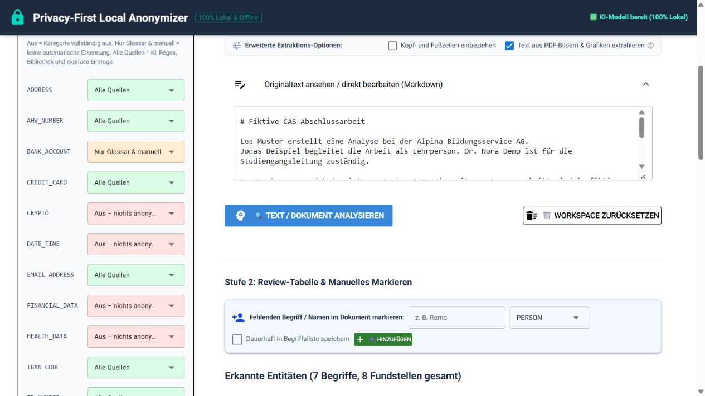

# Der erste Anonymisierungslauf

Dieses Kapitel beschreibt einen vollständigen Durchlauf mit dem fiktiven
Beispiel aus [`examples/cas-abschlussarbeit-beispiel.md`](../../examples/cas-abschlussarbeit-beispiel.md).
Du kannst die Datei direkt laden oder den Text in das Eingabefeld kopieren.

## 1. Dokument laden

Öffne im Tab **Anonymisieren & Review** eine Datei oder lege sie in den
Upload-Bereich. Unterstützt werden insbesondere:

- Word-Dateien (`.docx`);
- PDFs mit digitaler Textschicht (`.pdf`);
- Markdown und Text (`.md`, `.txt`);
- CSV- und JSON-Dateien.

Bei PDFs werden Formatierungen, Überschriften (`#`), Listen (`-`), Tabellen und Fettungen (`**`) strukturiert als Markdown extrahiert. Die Engine liest Textblöcke präzise in der natürlichen Lesereihenfolge ein und verhindert, dass Namen oder Adressen in Tabellen zerschnitten werden.

Über die **Erweiterten Extraktions-Optionen** direkt unter der Dokumentablage kannst du das Verhalten bei Bedarf anpassen:
- **Kopf- und Fußzeilen einbeziehen**: Liest wiederkehrende Kopf-/Fusszeilen (z. B. Seitenzahlen) mit ein (Standard: *Aus*).
- **Text aus PDF-Bildern & Grafiken extrahieren**: Liest Textboxen in Diagrammen und Vektorgrafiken aus (Standard: *Ein*).

Ein reiner Scan ohne Textschicht benötigt OCR; dieser Pfad ist in der aktuellen Version noch nicht Bestandteil des Standardablaufs.

Nach dem Laden kannst du den extrahierten Originaltext anzeigen und bei Bedarf direkt bearbeiten.

## 2. Erkennung konfigurieren

In der Seitenleiste findest du **Erkennung je Entitätstyp**. Für jede Kategorie
gibt es drei Modi:

- **Alle Quellen**: automatische Erkennung, Regex beziehungsweise Bibliothek
  sowie Glossar und manuelle Einträge;
- **Nur Glossar & manuell**: keine automatische Erkennung, aber explizite
  Einträge und manuelle Markierungen;
- **Aus**: die Kategorie ist vollständig deaktiviert.

Für den ersten Lauf kannst du die Voreinstellungen verwenden. Die optionale
Kategorie `ROLE` ist standardmässig ausgeschaltet, weil Funktionsbezeichnungen
wie `Lehrperson` oder `Studiengangsleitung` oft als fachlicher Inhalt erhalten
bleiben sollen.

*Beispielansicht mit fiktivem Text. Die konkreten Einträge in den Listen können
je nach Konfiguration und Projekt abweichen.*

## 3. Analyse starten

Klicke auf **Text / Dokument analysieren**. Die Anwendung verarbeitet den Text
lokal und baut anschliessend die Review-Tabelle auf.

Die Tabelle fasst gleiche Begriffe zusammen. Über die jeweilige Zeile kannst du
die einzelnen Fundstellen und ihren Kontext aufklappen.

## 4. Ergebnis verstehen

Eine Zeile enthält unter anderem:

- den erkannten Originalbegriff;
- die Anzahl seiner Fundstellen;
- den vorgeschlagenen Entitätstyp;
- den Score-Bereich über alle Fundstellen;
- eine Markierung **Review** oder **Sicher**;
- den vorgesehenen Platzhalter.

Die einzelnen Fundstellen zeigen zusätzlich, über welche Methode sie gefunden
wurden. Mehr dazu steht im Kapitel [Fundstellen prüfen](03-fundstellen-pruefen.md).

## 5. Anonymisierte Vorschau prüfen

Nach der Analyse erscheint die anonymisierte Vorschau. Kontrolliere vor dem
Export insbesondere:

- ob Namen und Kontaktangaben ersetzt wurden;
- ob interne Begriffe wie `SAP` oder `eClaims+` enthalten und korrekt
  eingeordnet sind;
- ob harmlose Begriffe versehentlich erkannt wurden;
- ob bei einer Fundstelle ein Review-Hinweis sichtbar ist;
- ob hinter einem Platzhalter möglicherweise noch ein Teil eines Namens steht.

Erst wenn die Vorschau plausibel ist, solltest du die anonymisierte Datei an
ein externes KI-System weitergeben.
