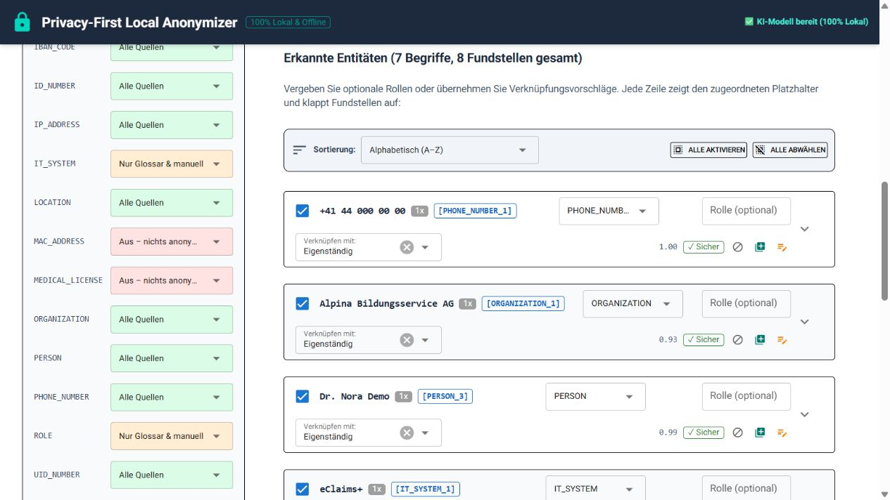

# Fundstellen prüfen und bearbeiten

Die automatische Erkennung ist eine Arbeitsgrundlage, keine abschliessende
Entscheidung. Die Review-Tabelle ist deshalb ein zentraler Bestandteil des
Werkzeugs.

## Entitätstypen und Quellenmodi

Die Seitenleiste steuert jede Kategorie unabhängig:

| Modus | Bedeutung |
|---|---|
| **Alle Quellen** | Sämtliche Quellen (KI, Bibliotheken, Regex, Glossar und manuelle Einträge) |
| **Nur Glossar, manuell, deterministisch & EU-PII** | Glossar, manuelle Einträge, deterministische Bibliotheken & EU-PII, aber ohne GLiNER (für PERSON, LOCATION, ID_NUMBER, HEALTH_DATA) |
| **Nur Glossar & manuell** | keine automatische Erkennung; nur explizite und manuelle Einträge |
| **Aus** | auch Glossar- und manuelle Treffer dieser Kategorie werden deaktiviert |

Die Farben unterstützen die Orientierung: Grün steht für **Alle Quellen**, Blau für **Nur Glossar, manuell, deterministisch & EU-PII**, Orange für **Nur Glossar & manuell** und Rot für **Aus**.

Wenn du einen Modus nach der Analyse änderst, werden bereits vorhandene Treffer
sofort nach der neuen Regel gefiltert. Für neu aktivierte automatische Quellen
musst du die Analyse nochmals starten.

## Erkennungsmethoden

Bei jeder Fundstelle wird die konkrete Erkennungsquelle transparent angezeigt:

- **🤖 GLiNER**: flexibles Zero-Shot-KI-Modell (besonders für Organisationen, Rollen und als Ergänzungsnetz);
- **🤖 EU-PII**: spezialisierter europäischer Token-Klassifikator mit Spitzenpräzision für Namen, Orte, Ausweis-IDs und Diagnosen;
- **🔤 Regex**: deterministisches Muster (z. B. für Prüfziffern-validierte AHV-, UID- oder IBAN-Nummern sowie E-Mail- und Adressmuster);
- **📚 Bibliothek**: Erkennung durch eine lokale Fachbibliothek (z. B. Google `phonenumbers` für Schweizer und internationale Telefonnummern);
- **📖 Glossar · direkt**: exakte Übereinstimmung mit deiner Begriffsliste;
- **📖 Glossar · Fuzzy**: fehlertolerante Ähnlichkeitsübereinstimmung;
- **✍ Manuell**: von dir für diesen Lauf markierte Fundstelle.

Ein Glossar-Treffer mit Sonderzeichen, etwa `eClaims+`, kann direkt sein, wenn
der Eintrag exakt so in der Begriffsliste steht.

## Score und Review

Der Score ist eine Einschätzung der jeweiligen Erkennungsmethode. Er ist keine
Garantie für die sachliche Richtigkeit. Die Oberfläche zeigt bei mehreren
Fundstellen den Score-Bereich, nicht nur einen einzelnen Wert.

Eine Gruppe erhält einen Review-Hinweis, sobald mindestens eine ihrer
Fundstellen unter dem aktuellen Review-Schwellenwert liegt. Deshalb kann eine
Zeile beispielsweise den Bereich `0.77–0.92` zeigen und trotzdem als **Review**
markiert sein. Prüfe in diesem Fall die einzelnen Fundstellen und ihren
Kontext.



*Die Tabelle zeigt unter anderem Entitätstyp, Score-Bereich und den Status der
Fundstellen. Für eine Entscheidung sollte zusätzlich der aufgeklappte Kontext
geprüft werden.*

## Treffer für den aktuellen Lauf ändern & Schnellaktionen

- **Alle aufklappen / zuklappen:** Über die Schaltfläche in der Aktionsleiste oberhalb der Tabelle kannst du mit einem Klick sämtliche Fundstellen-Kontexte aller Zeilen gleichzeitig öffnen oder wieder schliessen.
- **Alle aktivieren / Alle abwählen:** Schaltet sämtliche erkannten Gruppen auf einmal ein oder aus.
- **Gruppe aktivieren/deaktivieren:** Mit dem Kontrollkästchen links kannst du eine einzelne Gruppe aus der aktuellen Anonymisierung herausnehmen. Das ändert noch nicht die dauerhafte Ignore-Liste.
- **Kontext prüfen:** Für einzelne Fundstellen klappst du die Zeile auf. Dort siehst du den konkreten Textausschnitt, die genaue Erkennungsmethode und den Konfidenzwert.

## Ignore-Liste

Die Aktion **Ignorieren** fügt den Begriff der dauerhaften Ignore-Liste hinzu
und deaktiviert ihn im aktuellen Lauf. Er wird bei späteren Analysen ebenfalls
ignoriert.

Wenn ein Begriff nur dieses eine Mal nicht anonymisiert werden soll, entfernst
du lediglich das Häkchen der entsprechenden Gruppe und verwendest nicht die
Ignore-Aktion.

## Eigene Begriffsliste

Mit **Zum Glossar hinzufügen** wird der Begriff dauerhaft mit dem aktuell
gewählten Entitätstyp in die eigene Begriffsliste aufgenommen. Das ist sinnvoll
für interne Begriffe, Projektnamen, Systeme oder Namen, die zuverlässig erkannt
werden sollen.

Beispiele:

```text
SAP: IT_SYSTEM
eClaims+: IT_SYSTEM
Alpina Bildungsservice AG: ORGANIZATION
```

Die drei Quellenmodi gelten auch für Glossar-Einträge. Eine Kategorie mit Modus
**Aus** verwendet also auch ihre expliziten Glossar-Einträge nicht.

## Manuelle Markierung

Wenn ein relevanter Begriff nicht erkannt wurde, markierst du ihn im Bereich
**Fehlenden Begriff / Namen im Dokument markieren**. Wähle den Entitätstyp und
füge die Markierung hinzu.

Eine manuelle Markierung gilt zunächst für den aktuellen Lauf. Soll sie künftig
automatisch wiedererkannt werden, ist zusätzlich ein Glossar-Eintrag sinnvoll.

## Rollen und Schreibweisen

In der Review-Tabelle kannst du einer Entität optional eine Rolle geben, zum
Beispiel `LEHRPERSON` oder `STUDIENGANGSLEITUNG`. Diese Rolle beeinflusst den
Platzhalter, ändert aber nicht automatisch den Entitätstyp.

Verwandte Schreibweisen wie ein Vorname, eine Anrede oder ein Genitiv können
mit einer Hauptperson verknüpft werden. Überprüfe solche Vorschläge immer im
Kontext, bevor du sie übernimmst.
