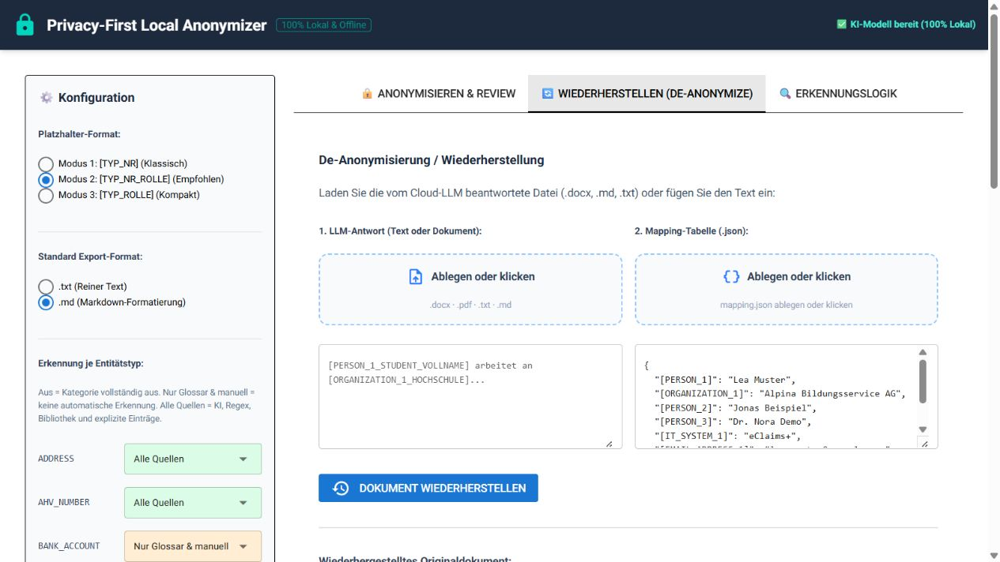

# LLM-Nutzung, Export und Wiederherstellung

## Exportdateien

Nach dem Review kannst du die anonymisierte Vorschau und die zugehörigen
Informationen speichern. Beim vollständigen Export entstehen typischerweise:

1. eine anonymisierte Text- oder Markdown-Datei;
2. eine Mapping-Datei (`*_mapping.json`);
3. ein Prüfbericht (`*_report.json`).

Die anonymisierte Datei ist für die Weitergabe an ein externes oder internes Verarbeitungs-LLM vorgesehen (z. B. ChatGPT, Claude, Microsoft Copilot oder ein lokales Modell für Textzusammenfassungen).

> [!NOTE]
> **Begriffliche Unterscheidung:**
> Unterscheide klar zwischen der **lokalen LLM-Review-Assistenz** (die während der Triage auf deinem Rechner läuft und einzelne Fundstellen prüft) und dem **nachgelagerten Verarbeitungs-LLM** (an das du den fertig anonymisierten Gesamttext für deine eigentliche Arbeitsaufgabe sendest).

Die Mapping-Datei enthält die Zuordnung zwischen Platzhaltern und Originalwerten
und muss lokal beziehungsweise geschützt aufbewahrt werden.

## Arbeit mit einem Verarbeitungs-LLM (Cloud oder On-Premise)

Übermittle nur die anonymisierte Datei und deinen Arbeitsauftrag. Kontrolliere
vorher, dass keine Originalnamen, E-Mail-Adressen, internen Systeme oder
anderen vertraulichen Angaben in der Datei verblieben sind.

### Wichtiger Hinweis zu den Platzhaltern

Setze vor deinen eigentlichen Arbeitsauftrag mindestens diesen Satz:

> Behandle alle Tokens im Format `[TYP_...]` als unveränderliche Platzhalter: Verändere, übersetze, lösche oder ersetze sie nicht und übernimm sie an allen passenden Stellen exakt.

Bei längeren Aufgaben kannst du zusätzlich folgende Anweisung verwenden:

```text
Die Platzhalter im Dokument sind geschützt. Bitte verändere niemals ihre
Schreibweise, Gross-/Kleinschreibung, eckigen Klammern, Unterstriche oder
Nummern. Übersetze, lösche oder ersetze keine Platzhalter und erfinde keine
neuen Platzhalter. Wenn du einen anonymisierten Namen, eine Organisation oder
ein System erwähnst, verwende den vorhandenen Platzhalter exakt. Gib deine
Antwort so zurück, dass alle vorhandenen Platzhalter erhalten bleiben.
```

Das ist eine wichtige Vorsichtsmassnahme, aber keine technische Garantie. Ein
LLM kann Platzhalter trotzdem löschen, verändern oder inhaltlich ersetzen.
Prüfe deshalb die Antwort vor der Wiederherstellung.

### Beispiel für einen Arbeitsauftrag

```text
Bitte fasse den folgenden anonymisierten Text auf maximal 500 Wörter zusammen.
Behalte die Kernaussagen und die Gliederung bei. Die Platzhalter sind geschützt
und müssen exakt erhalten bleiben:

Behandle alle Tokens im Format `[TYP_...]` als unveränderliche Platzhalter:
Verändere, übersetze, lösche oder ersetze sie nicht und übernimm sie an allen
passenden Stellen exakt.

[ANONYMISIERTER TEXT HIER EINFÜGEN]
```

Verwende nicht versehentlich die Mapping-Datei als Teil dieses Auftrags.

## Optionale Ausgangskontrolle (Nachzügler-Suche via lokales LLM)

Vor dem Export kannst du den fertig anonymisierten Text einer zusätzlichen, automatisierten Ausgangskontrolle (Postcheck) unterziehen. Ein lokales LLM scannt den Ausgabetext auf im Klartext verbliebene, übersehene personenbezogene Daten:

- **Unabhängig nutzbar:** Die Ausgangskontrolle steht auch dann zur Verfügung, wenn du den Schalter „LLM-Review aktivieren“ im Bereich der LLM-Review-Assistenz (Stufe 2) nicht eingeschaltet oder übersprungen hast.
- **Gemeinsame Modelleinstellungen:** Die Konfiguration des lokalen Modells (z. B. `qwen3:8b` via Ollama) erfolgt zentral im oberen Einstellungsbereich. Der Schalter „LLM-Review aktivieren“ und die Checkbox „LLM-Review direkt an die Textanalyse anschließen“ befinden sich dagegen im Bereich der Review-Assistenz weiter unten und bleiben dort auch bei ausgeschaltetem Review erreichbar.
- **Kontextbestätigung & Budget:** Aus Sicherheitsgründen ist das Gesamtbudget auf 32.000 Tokens (bei 4.096 Tokens Antwortreserve) begrenzt. Bei unbekanntem Server-Limit bestätigst du vorab per Checkbox, dass dein lokaler Server für mindestens 32k Tokens ausgelegt ist. Diese Bestätigung gilt nur für die aktuell gewählte Modell-/Endpunkt-Kombination: Wechselst du das Modell oder den Endpunkt, verlangt die App eine erneute Bestätigung. Ein reines Ablaufen der Modellbereitschaft (Ollama-Keep-alive) bei unverändertem Modell/Endpunkt verlangt dagegen keine erneute Bestätigung.
- **Auswahl & atomare Übernahme:** Findet das Modell Nachzügler, erscheinen diese in einer separaten Auswahlliste. Du wählst die gewünschten Treffer per Checkbox aus und klickst auf **„Ausgewählte übernehmen“**. Die neuen Platzhalter werden atomar in den Text eingefügt, die Entitätstabelle aktualisiert und die Mapping-Datei synchronisiert.
- **Abbruch jederzeit möglich:** Ein Klick auf „Abbrechen“ beendet den Lauf sofort und gibt alle gesperrten Steuerelemente wieder frei.

## Wiederherstellung

Wechsle in den Tab **Wiederherstellen (De-Anonymize)** und lade:

1. die Antwort des LLM als `.docx`, `.md` oder `.txt` beziehungsweise füge den
   Text ein;
2. die zugehörige Mapping-Datei (`.json`).

Klicke danach auf **Dokument wiederherstellen**. Die Platzhalter werden durch
die lokal gespeicherten Originalwerte ersetzt.



*Auch in diesem Schritt bleibt die Mapping-Datei lokal und wird getrennt von
der anonymisierten LLM-Datei behandelt.*

Prüfe das Ergebnis anschliessend kurz auf:

- unveränderte Platzhalter;
- vom LLM umformulierte oder gelöschte Platzhalter;
- Formatierungsänderungen;
- Stellen, an denen der LLM-Inhalt bewusst vom Original abweicht.

## Mapping und Bericht schützen

Die Mapping-Datei ist kein gewöhnlicher Export für die Weitergabe. Bewahre sie
getrennt von der anonymisierten Datei auf und teile sie nur, wenn die
Originalwerte ausdrücklich benötigt werden.
